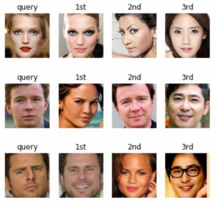

# Face Recognition 

## Dataset
- **[CelebA Dataset](http://mmlab.ie.cuhk.edu.hk/projects/CelebA.html)**

##  Dependencies
* tensorflow==2.1.0
* opencv-python
* mtcnn
* pandas
* numpy
* ...
## References
*  [FaceNet: A Unified Embedding for Face Recognition and Clusterin](https://arxiv.org/abs/1503.03832)
* [Joint Face Detection and Alignment using Multi-task Cascaded Convolutional Networks](https://arxiv.org/ftp/arxiv/papers/1604/1604.02878.pdf)
